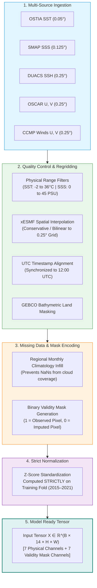
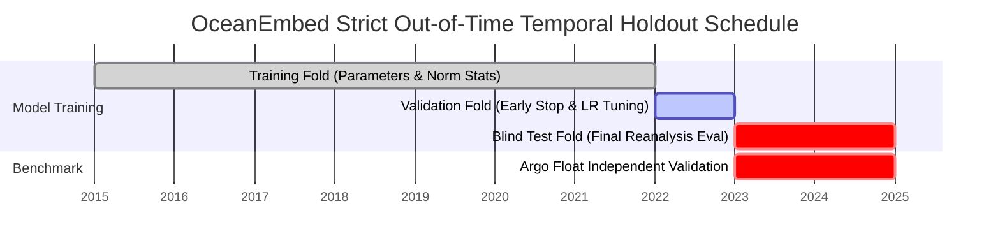
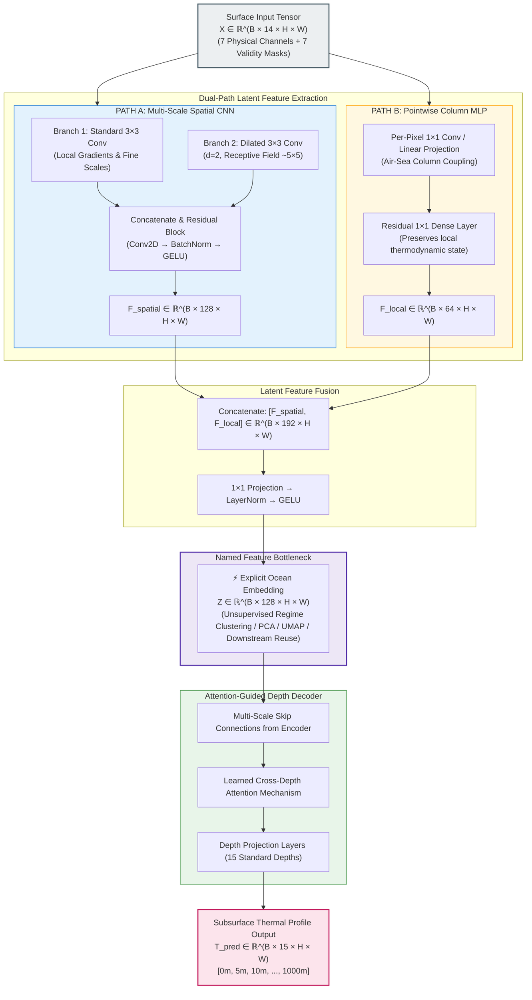
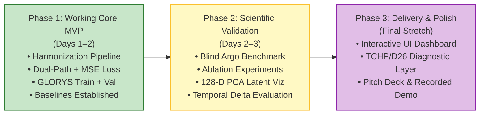

<div align="center">

# 🌊 OceanEmbed
### Satellite-Embedding-Based Deep Learning Framework for Subsurface Ocean Temperature Reconstruction

[-0A3871?style=for-the-badge&logo=india&logoColor=white)](https://moes.gov.in/)
[](https://incois.gov.in/)
[]()
[]()
[]()
[](https://www.python.org/)
[](https://pytorch.org/)

**A scientifically rigorous, dual-path deep learning architecture fusing multi-source satellite surface observations into an explicit 128-dimensional latent ocean embedding to reconstruct 3D subsurface thermal fields (0–1000 m).**

[Executive Summary](#-executive-summary) •
[Problem Framing](#1-problem-framing--scientific-context) •
[Datasets & Sources](#2-satellite-inputs--datasets) •
[Data Harmonization](#3-data-harmonization-pipeline) •
[Model Architecture](#5-core-model-architecture) •
[Loss Formulation](#7-loss-function--physics-guided-terms) •
[Roadmap & Triage](#12-phased-build-order--triage) •
[Judge Pitch Strategy](#14-pitch-script--defense-strategy)

---

</div>

## 🧭 Executive Summary & Core Philosophy

> [!IMPORTANT]
> **Scientific Integrity Rule:** Position OceanEmbed as an **estimation and gap-filling framework** that complements sparse in-situ ocean observations — **never** as a replacement for Argo floats, gliders, or moorings, and **never** as "measuring" the deep ocean directly.

This technical specification establishes an implementation-ready, end-to-end blueprint for **Problem Statement 26066**. It synthesizes high-capacity deep learning design with strict oceanographic empirical discipline:

1. **Rigor Over Speculation:** We strip all unearned performance claims (e.g. unverified RMSE numbers or speculative VRAM metrics) prior to experimental measurement. All metrics are evaluated against physical baselines.
2. **Phase-1 Baseline Guarantee:** Build order mandates a verified, leak-free, working end-to-end baseline (single-day input + dual-path network + MSE loss) before any speculative features (temporal deltas, complex physics constraints) are introduced.
3. **Zero Data Leakage:** Strict out-of-time temporal holdout splits. Independent in-situ Argo profiling data is never exposed during training, normalization fitting, or hyperparameter selection; it is evaluated strictly once during blind final testing.

---

## 📑 Table of Contents
- [1. Problem Framing & Scientific Context](#1-problem-framing--scientific-context)
- [2. Satellite Inputs & Datasets](#2-satellite-inputs--datasets)
- [3. Data Harmonization Pipeline](#3-data-harmonization-pipeline)
- [4. Temporal Train / Val / Test Partition](#4-temporal-train--val--test-partition)
- [5. Core Model Architecture](#5-core-model-architecture)
- [6. Temporal Dynamics (Phased Integration)](#6-temporal-dynamics-phased-integration)
- [7. Loss Function & Physics-Guided Terms](#7-loss-function--physics-guided-terms)
- [8. Baselines & Ablation Study Protocol](#8-baselines--ablation-study-protocol)
- [9. Downstream Applications & Interpretability](#9-downstream-applications--interpretability)
- [10. Scientific Pitch Defense: What NOT to Claim](#10-scientific-pitch-defense-what-not-to-claim)
- [11. System Stack & Repository Layout](#11-system-stack--repository-layout)
- [12. Phased Build Order & Triage](#12-phased-build-order--triage)
- [13. Interactive Demo & Verification Blueprint](#13-interactive-demo--verification-blueprint)
- [14. Pitch Script & Defense Strategy](#14-pitch-script--defense-strategy)

---

## 1. Problem Framing & Scientific Context

Satellites directly observe only the top skin-layer (~1 mm to 1 m) of the ocean. **OceanEmbed** learns the non-linear physical/statistical mapping between surface signatures observable from space and the depth-wise subsurface temperature structure across the **North Indian Ocean (5°N–30°N, 45°E–105°E)** across **15 standard oceanographic depths**:

$$\mathcal{D} = \{0, 5, 10, 20, 30, 50, 75, 100, 125, 150, 200, 300, 500, 700, 1000\}\text{ meters}$$

```
   Surface (0m)    [ Satellites observe SST, SSS, SSH, Currents, Winds ]
        │
   Mixed Layer     [ Strong turbulent mixing, directly wind/flux driven ]
   (0m - 50m)
        │
   Thermocline     [ Rapid vertical temperature drop ∂T/∂z << 0 ]
   (50m - 200m)    [ Crucial for TCHP, D26, and Cyclone Heat Potential ]
        │
   Deep Ocean      [ Weak surface coupling; stable stratified water masses ]
   (200m - 1000m)
```

### 🎯 Key Domain Applications
- **Tropical Cyclone Heat Potential (TCHP) & $D_{26}$:** Cyclogenesis and rapid cyclone intensification in the Bay of Bengal and Arabian Sea are directly governed by the ocean heat content above the 26°C isotherm ($D_{26}$).
- **Monsoon Air-Sea Coupling:** Subsurface heat storage controls intraseasonal sea surface temperature feedbacks to the Indian Summer Monsoon.
- **Barrier Layer Dynamics:** Subsurface salinity-stratified barrier layers (formed by massive Ganges–Brahmaputra freshwater discharge) trap heat and inhibit vertical mixing.
- **Spatio-Temporal Gap Filling:** In-situ Argo floats sample approximately once every ~3° every ~10 days. OceanEmbed delivers a continuous, daily **0.25° gridded volume** bridging the gaps between discrete float tracks.

---

## 2. Satellite Inputs & Datasets

Seven multi-sensor daily surface variables from peer-reviewed, open-access satellite missions:

| Variable | Parameter Description | Native Grid | Temporal | Primary Source / DOI | Data Access Portal |
| :--- | :--- | :---: | :---: | :--- | :--- |
| **SST** | Foundation Sea Surface Temperature | 0.05° | Daily | OSTIA (`10.48670/moi-00168`) | CMEMS / UK Met Office |
| **SSS** | Sea Surface Salinity | 0.125° | Daily | SMAP/SMOS L4 Blended (`10.48670/moi-00051`) | NASA JPL / CMEMS |
| **SSH / SLA** | Sea Surface Height & Anomaly | 0.25° | Daily | DUACS Multi-Mission Altimeter (`10.48670/moi-00145`) | CMEMS Altimetry |
| **Current U** | Surface Zonal Geostrophic + Ekman | 0.25° | Daily | OSCAR L4 OC (`OSCAR_L4_OC_FINAL_V2.0`) | NASA PO.DAAC |
| **Current V** | Surface Meridional Geostrophic + Ekman | 0.25° | Daily | OSCAR L4 OC (`OSCAR_L4_OC_FINAL_V2.0`) | NASA PO.DAAC |
| **Wind U** | 10m Zonal Wind Vector | 0.25° | Daily | CCMP v3.1 / ASCAT-C | PO.DAAC / EUMETSAT |
| **Wind V** | 10m Meridional Wind Vector | 0.25° | Daily | CCMP v3.1 / ASCAT-C | PO.DAAC / EUMETSAT |

### 🎯 Training Target vs. Ground Truth Benchmark

```
  ┌──────────────────────────────────────────────┐     ┌──────────────────────────────────────────────┐
  │         TRAINING TARGET: GLORYS12V1          │     │         INDEPENDENT BENCHMARK: ARGO          │
  │ • Copernicus Global Ocean Physics Reanalysis │     │ • INCOIS Live Access Server (LAS) QC Profiles│
  │ • Native 0.083°, 50 vertical levels          │     │ • Physical in-situ CTD float measurements    │
  │ • Resampled to 0.25° at 15 standard depths   │     │ • STRICT ZERO-LEAKAGE: Seen only during      │
  │ • Serves as dense supervisory target         │     │   final out-of-time blind validation         │
  └──────────────────────────────────────────────┘     └──────────────────────────────────────────────┘
```

> [!TIP]
> **Operational Fallback Protocol:** Satellite distribution servers (CMEMS, PO.DAAC) frequently throttle or experience scheduled downtime. Prior to triggering full multi-year bulk transfers, execute a **1-month pipeline dry-run** across all 7 variables. If an upstream service is delayed, implement pre-planned fallbacks (e.g. ERA5 wind proxies or secondary blended products) without blocking core development.

---

## 3. Data Harmonization Pipeline

The ingestion pipeline converts raw multi-format NetCDF/HDF files into an aligned, normalized, model-ready PyTorch tensor:



### 🛡️ Missing-Data Strategy: Observation-Aware Infill
Rather than naive interpolation or zero-filling:
1. Gaps (e.g. infrared SST cloud obscuration) are infilled with regional, monthly climatological values.
2. An explicit **7-channel binary validity mask** is generated:
   $$M_c(i, j) = \begin{cases} 1 & \text{if pixel } (i, j) \text{ was directly observed} \\ 0 & \text{if pixel } (i, j) \text{ was climatologically imputed} \end{cases}$$
3. Concatenating these validity masks directly into the input tensor allows the network to dynamically learn confidence weights per region.

### 📐 Normalization Guardrail
$$X_{\text{norm}}^{(c)} = \frac{X^{(c)} - \mu_{\text{train}}^{(c)}}{\sigma_{\text{train}}^{(c)}}$$
$\mu_{\text{train}}$ and $\sigma_{\text{train}}$ are calculated **exclusively** on training-period pixels. Validation and blind-test years are transformed using frozen training parameters to strictly eliminate information leakage.

---

## 4. Temporal Train / Val / Test Partition

Because oceanographic processes exhibit strong multi-day spatio-temporal autocorrelation, random cross-validation splits cause massive data leakage and produce fictitiously optimistic validation metrics. OceanEmbed uses a strict **chronological partition**:

```
2015 ───────────────────────────────── 2021   │      2022      │   2023 ────────────────── 2024
                 TRAINING                     │   VALIDATION   │           BLIND TEST
          (7 Continuous Years)                │    (1 Year)    │            (2 Years)
 • Parameter optimization                     │ • Early stop   │ • Out-of-time evaluation
 • Calculate normalization (μ, σ)             │ • LR scheduler │ • Independent ARGO float validation
 • GLORYS reanalysis loss supervision         │ • Hyperparams  │ • Reported once in final benchmarks
```



---

## 5. Core Model Architecture

OceanEmbed implements a **Dual-Path Encoder** fusing spatially-distributed context (mesoscale dynamics) with pointwise physical column state, compressed into a compact **128-dimensional Ocean Embedding**, and decoded through an **Attention-Guided Decoder**:



### 🔬 Architecture Engineering Rationales

1. **Why Dual-Path?**
   - **Spatial CNN (Path A):** Encodes regional gradients, eddies, thermal fronts, and current divergence patterns across space.
   - **Pointwise MLP (Path B):** Preserves local, single-column air-sea equilibrium without allowing spatial pooling to wash out localized surface anomalies.
2. **Defensible Receptive-Field Framing:**
   - Dual scales provide multi-resolution context. We avoid claiming that "3×3 explicitly detects plumes while 5×5 detects eddies." Instead, we describe it as *combining fine-grained local horizontal gradients with regional mesoscale context*.
3. **Data-Driven Depth Attention:**
   - Rather than hard-coding attention windows to specific depths (e.g. 50–200 m), the decoder learns cross-depth attention weights dynamically from data. Post-training attention weight analysis is presented as an interpretability finding.
4. **The 128-D Ocean Embedding ($Z$):**
   - Serves as a modular, latent representation of the ocean state. Can be decoupled from the decoder for 2D latent space visualization (PCA/UMAP) or transferred to downstream prediction tasks (e.g. cyclogenesis likelihood, marine heatwave detection).

---

## 6. Temporal Dynamics (Phased Integration)

```
  PHASE 1 (MVP Baseline)                               PHASE 2 (Dynamical Enhancement)
  ┌───────────────────────────────┐                    ┌───────────────────────────────┐
  │ • Single-day surface snapshot │   Validate skill   │ • Single-day snapshot (14 ch) │
  │ • 7 physical + 7 mask channels│ ─────────────────> │ • Plus 3-day temporal deltas: │
  │ • Total = 14 Input Channels   │   Show delta Δ     │   ΔSST (t - t-3), ΔSSH        │
  │ • Working baseline guarantee  │                    │ • Total = 16 Input Channels   │
  └───────────────────────────────┘                    └───────────────────────────────┘
```

> [!NOTE]
> Temporal delta features are only retained if Phase-2 cross-validation demonstrates a statistically significant RMSE reduction over the Phase-1 baseline. They are presented as *dynamical trend indicators*, avoiding premature claims of deterministic eddy tracking.

---

## 7. Loss Function & Physics-Guided Terms

Training follows an additive progression: baseline convergence first, followed by physics-guided regularizers evaluated as controlled ablations.

### Phase 1: Unweighted Depth MSE (Core Floor)
$$\mathcal{L}_{\text{Phase-1}} = \frac{1}{15} \sum_{d=1}^{15} \text{MSE}\left(\hat{T}_d, T_d^{\text{GLORYS}}\right)$$

### Phase 2: Multi-Objective Regularized Loss
$$\mathcal{L}_{\text{total}} = \mathcal{L}_{\text{MSE}} + \lambda_{\text{smooth}}\mathcal{L}_{\text{smooth}} + \lambda_{\text{inv}}\mathcal{L}_{\text{inv}}$$

$$\mathcal{L}_{\text{smooth}} = \frac{1}{D-2}\sum_{d=2}^{D-1} \left\| \left( \hat{T}_{d+1} - \hat{T}_d \right) - \left( \hat{T}_d - \hat{T}_{d-1} \right) \right\|_2^2$$

$$\mathcal{L}_{\text{inv}} = \frac{1}{D-1}\sum_{d=1}^{D-1} \text{ReLU}\left( \hat{T}_{d+1} - \hat{T}_d - \delta_{\text{tol}} \right)$$

```
                               LOSS COMPONENT ROLES
 ┌───────────────────────────────────┬─────────────────────────────────────────────────┐
 │ Component                         │ Physical Purpose                                │
 ├───────────────────────────────────┼─────────────────────────────────────────────────┤
 │ Depth MSE (L_MSE)                 │ Primary thermal reconstruction accuracy         │
 │ Curvature Smoothness (L_smooth)   │ Penalizes unphysical jagged vertical profiles   │
 │ Soft Inversion Tolerance (L_inv)  │ Discourages extreme unphysical spikes while     │
 │                                   │ accommodating real salinity-driven inversions   │
 └───────────────────────────────────┴─────────────────────────────────────────────────┘
```

> [!CAUTION]
> **No Absolute Monotonicity Penalty:** In the North Indian Ocean (especially the Bay of Bengal during winter and post-monsoon), genuine temperature inversions occur due to freshwater barrier-layer stratification. A rigid monotonicity penalty ($\hat{T}_z \ge \hat{T}_{z+1}$) violates basic ocean physics. $\mathcal{L}_{\text{inv}}$ must only penalize sharp unphysical spikes exceeding $\delta_{\text{tol}}$.

---

## 8. Baselines & Ablation Study Protocol

Every architectural component must justify its parameter budget. Evaluation is reported across all 15 depths using **RMSE, MAE, Mean Bias, and Pearson Correlation ($r$)**:

| Model Variant | Structural Configuration | Target Experimental Question |
| :--- | :--- | :--- |
| **Climatology Baseline** | Monthly spatial mean profile | What is the predictive floor? Does ML beat seasonal averages? |
| **Ridge Regression** | Depth-independent linear mapping | Does deep learning non-linearity justify its model complexity? |
| **Ablation: CNN-Only** | Dual-path without Pointwise MLP | What is the isolated value of spatial horizontal context? |
| **Ablation: MLP-Only** | Pointwise MLP without Spatial CNN | What is the isolated value of single-column air-sea coupling? |
| **Phase-1 Full Model** | Dual-Path + Fusion + Attention Decoder | Primary architectural benchmark on single-day inputs |
| **Ablation: No-Attention** | Dual-Path with direct convolutional decoder | What is the specific gain of learned cross-depth attention? |
| **Phase-2 Temporal** | 16-Channel input (+ $\Delta\text{SST}, \Delta\text{SSH}$) | Does short-term temporal memory measurably lower RMSE? |
| **Feature Sensitivity** | Leave-One-Variable-Out (drop SSS, SSH, etc.) | Which surface variable provides the strongest vertical coupling? |

---

## 9. Downstream Applications & Interpretability

```
                               OCEANEMBED PIPELINE
                                       │
                                [ Latent Z ]
                                       │
                ┌──────────────────────┴──────────────────────┐
                ▼                                             ▼
     LATENT MANIFOLD INSPECTION                     DOWNSTREAM OCEAN PRODUCTS
  • 2D PCA / UMAP Latent Space                   • Tropical Cyclone Heat Potential (TCHP)
  • Regimes: Upwelling vs Oligotrophic           • Depth of 26°C Isotherm (D26)
  • Seasonal Cycle Trajectories                  • Barrier Layer Thickness (BLT)
```

### 🌀 Downstream Diagnostic Calculations
1. **Tropical Cyclone Heat Potential (TCHP):**
   $$\text{TCHP} = \rho c_p \int_{0}^{D_{26}} \left(T(z) - 26\right) dz$$
   *(Integrated ocean heat energy fueling rapid cyclone intensification).*
2. **$D_{26}$ Isotherm Depth:**
   $$D_{26} = \text{Depth where } T(z) = 26^\circ\text{C}$$
3. **Uncertainty Quantification (Phase 3 Extension):**
   - Monte-Carlo Dropout (10 forward stochastic passes at inference) yields depth-wise variance $\sigma_d^2(x, y)$, providing spatial error bounds to operational forecasters.

---

## 10. Scientific Pitch Defense: What NOT to Claim

| ❌ Red Flag Claim (Avoid completely) | ✅ Defensible Scientific Statement (Use with judges) | Why Judges Value This Distinction |
| :--- | :--- | :--- |
| *"This model directly measures the deep ocean from space."* | *"This reconstructs an estimated 3D profile by learning non-linear surface-to-subsurface statistical & physical linkages."* | Satellites observe only electromagnetic emissions from the surface skin layer (~1 mm to 1 m). |
| *"Our AI replaces Argo floats and oceanographic research ships."* | *"This complements sparse in-situ profiling networks by providing high-resolution daily 0.25° gridded fields in the gaps between them."* | In-situ physical floats remain the fundamental ground truth required to validate and calibrate models. |
| *"The network achieves uniform high accuracy down to 1000m."* | *"Reconstruction skill naturally degrades with depth as physical surface-coupling weakens, which we transparently quantify."* | Deep ocean dynamics (>500m) are increasingly decoupled from high-frequency surface variability. |
| *"We achieved a pre-determined 0.28°C RMSE target before running experiments."* | *"We benchmark against climatology and ridge baselines, reporting empirical RMSE on out-of-time blind Argo floats."* | Pre-registering arbitrary target numbers before data verification undermines scientific credibility. |

---

## 11. System Stack & Repository Layout

```
OceanEmbed/
├── .github/workflows/          # CI/CD automated linting & unit tests
├── data/
│   ├── raw/                    # Raw NetCDF4/HDF files (gitignored)
│   ├── processed/              # Regridded 0.25° Zarr/NetCDF stores
│   └── climatology/            # Monthly reference climatologies for infill
├── pipeline/
│   ├── downloaders/            # CMEMS, PO.DAAC, and INCOIS automated fetchers
│   ├── qc.py                   # Range validation & anomaly screening
│   ├── regrid.py               # xESMF conservative/bilinear remapping
│   ├── harmonize.py            # Missing data masking & validity tensor generation
│   └── normalizer.py           # Training-fold z-score parameters
├── models/
│   ├── dual_path.py            # Spatial CNN + Pointwise MLP + Bottleneck
│   ├── attention_decoder.py    # Cross-depth attention decoding network
│   ├── losses.py               # Depth MSE, curvature smoothness, soft inversion
│   └── ocean_embed.py          # Unified Lightning/PyTorch Module
├── baselines/
│   ├── climatology.py          # Empirical monthly climatology baseline
│   └── ridge_regression.py     # Linear column-wise benchmark
├── eval/
│   ├── metrics.py              # RMSE, MAE, bias, correlation per depth
│   ├── argo_benchmark.py       # Blind validation against INCOIS Argo floats
│   └── ablation_runner.py      # Automated benchmark orchestration
├── api/
│   ├── main.py                 # FastAPI operational inference service
│   └── schemas.py              # Pydantic request/response schemas
├── dashboard/                  # React + Leaflet map + Plotly profile viewer
├── notebooks/                  # PCA exploration, error maps, judge pitch charts
├── docker/
│   ├── Dockerfile.pipeline
│   └── Dockerfile.api
├── docker-compose.yml
├── requirements.txt
└── README.md
```

### 🔒 Data-Leakage Audit Checklist
- [ ] **Temporal Segregation:** Normalization statistics ($\mu, \sigma$) computed solely on training years (2015–2021).
- [ ] **Argo Sanctuary:** In-situ Argo float profiles remain untouched during training and tuning; accessed strictly once on final holdout evaluation.
- [ ] **Causal Directionality:** Temporal deltas ($\Delta\text{SST}, \Delta\text{SSH}$) strictly reference backward time steps ($t - 3$ to $t$).
- [ ] **Out-of-Time Test Window:** Test evaluation years (2023–2024) are strictly segregated from training data.

---

## 12. Phased Build Order & Triage



### ⚖️ Priority Triage Matrix

| Tier | Milestone Deliverable | Criteria for Inclusion |
| :--- | :--- | :--- |
| **Must-Have** *(Floor)* | End-to-end regridded data pipeline (0.25°) | Mandatory for functional execution |
| **Must-Have** *(Floor)* | Dual-path CNN+MLP model trained on single-day inputs | Mandatory baseline architecture |
| **Must-Have** *(Floor)* | Baseline comparison (Climatology + Ridge) | Demonstrates ML added value |
| **Must-Have** *(Floor)* | Blind evaluation against real Argo float profiles | Validates physical authenticity |
| **Should-Have** | Systematic ablation table (CNN-only, MLP-only, No-Attention) | Proves design choices to judges |
| **Should-Have** | 128-D Embedding visualization (PCA / UMAP clusters) | High-impact visual evidence |
| **Should-Have** | Regional error maps (Arabian Sea vs. Bay of Bengal) | Oceanographic depth & rigor |
| **Nice-to-Have** | 3-Day temporal delta channels ($\Delta\text{SST}, \Delta\text{SSH}$) | Retain only if delta improves validation |
| **Nice-to-Have** | Interactive React + Leaflet + Plotly web dashboard | Operational presentation polish |
| **Nice-to-Have** | TCHP & $D_{26}$ isotherm diagnostic layers | Demonstrates downstream MoES utility |

---

## 13. Interactive Demo & Verification Blueprint

The target live demo presents a unified interactive validation screen:

```
┌────────────────────────────────────────────────────────────────────────────────────────┐
│  OCEANEMBED OPERATIONAL DASHBOARD                                                      │
├───────────────────────────────────────────┬────────────────────────────────────────────┤
│  1. REGIONAL SURFACE MAP (0.25° Daily)    │  2. RECONSTRUCTED PROFILE VS. BLIND ARGO   │
│                                           │     Temperature (°C)                       │
│     Bay of Bengal / Arabian Sea           │     0    5    10   15   20   25   30       │
│     [ Interactive Leaflet Map ]           │  0m ┌─────────────────────────●──┐        │
│                                           │     │                         │  │         │
│     Clicked Coordinate:                   │ 100m│                 ▲       │  │         │
│     Lat: 14.25°N  Lon: 88.50°E            │     │                 │       │  │         │
│     Date: 2023-05-18                      │ 200m│        Thermocline      │  │         │
│                                           │     │                 ▼       │  │         │
│     Selected: Mesoscale Cyclonic Eddy     │ 500m│         ● Model Pred   │  │         │
│                                           │     │         ── Blind Argo   │  │         │
│                                           │1000m└────────────────────────────┘         │
├───────────────────────────────────────────┴────────────────────────────────────────────┤
│  3. 128-D LATENT SPACE PROJECTION (PCA / UMAP)                                         │
│                                                                                        │
│     Cluster A: Bay of Bengal River Plume       Cluster B: Arabian Sea Upwelling        │
│     Current Selection: [★] (Positioned inside Open-Ocean Cyclonic Eddy regime)        │
└────────────────────────────────────────────────────────────────────────────────────────┘
```

1. **User clicks any coordinate & date** on the interactive North Indian Ocean map.
2. **Model reconstructs the 15-depth temperature profile** in <50ms.
3. **Nearest real blind Argo float** profile is overlaid in real time, demonstrating empirical concordance.
4. **128-D Latent space projector** highlights where this column sits within regional ocean regimes.

---

## 14. Pitch Script & Defense Strategy

### ⚡ 30-Second Elevator Pitch
> *"Satellites provide exceptional daily coverage of the ocean surface, but the thermal energy that fuels deadly cyclones in the Bay of Bengal resides hundreds of meters below. **OceanEmbed** is a dual-path deep learning framework that compresses multi-sensor satellite observations into an explicit 128-dimensional Ocean Embedding, decoding the full 3D subsurface temperature structure down to 1000 meters. Trained against high-resolution ocean reanalysis and independently verified against real, unobserved Argo floats, OceanEmbed turns surface satellite imagery into continuous, operational 3D subsurface intelligence."*

### 🎙️ Problem → Solution → Innovation → Validation
- **The Problem:** Satellites cannot penetrate deeper than a fraction of an inch into the ocean. Crucial indicators of cyclone intensification, monsoon dynamics, and marine heatwaves are invisible at the surface.
- **The Solution:** We learn the non-linear transfer function between surface signatures (temperature, salinity, height, currents, winds) and vertical water columns across 15 standard depths.
- **The Innovation:** The explicit **128-D Ocean Embedding bottleneck** allows physical regime interpretation, latent clustering, and modular reuse for downstream marine hazards.
- **The Validation:** Strict zero-leakage temporal splits, benchmarked against Climatology and Ridge Regression baselines, and rigorously cross-validated against in-situ INCOIS Argo floats.

---

<div align="center">
  <sub>Developed for Problem Statement 26066 · Ministry of Earth Sciences (MoES) / INCOIS</sub>
</div>
